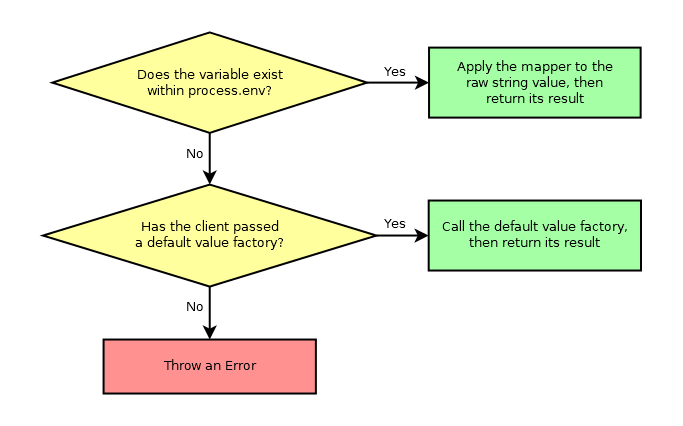

# typed-env

_Tiny, elegant library for type-safe environment variables_


[](https://badge.fury.io/js/@giancosta86%2Ftyped-env)
[](/LICENSE)



**typed-env** is a minimalist **TypeScript** library for **Node.js**, focused on _type-checked environment variables_ - which can therefore have a _type_ and a _default value_, with lightweight notation.

Additionally, the library provides a simplified, type-checked way to explore the nuances of the **NODE_ENV** environment variable.

Only _read access_ is supported, mainly because in-process modification of environment variables tends to be a discouraged pattern - that can always be achieved by altering `process.env`; however, the _delayed_ approach adopted by **typed-env** makes the library compatible with that scenario as well.

## Installation

```bash
npm install @giancosta86/typed-env
```

or

```bash
yarn add @giancosta86/typed-env
```

## Usage

All the recommended features are exported by the index file - and can be imported as usual:

```typescript
import {...} from @giancosta86/typed-env
```

### EnvironmentVariable\<T\>

The `EnvironmentVariable<T>` class is the very heart of the library - although you will often instantiate it via the utility functions described below, thus using only its **getValue()** method.

`EnvironmentVariable<T>` works as follows:

- the `constructor` takes 2 parameters:

  - the **name** of the environment variable, as it is should appear in `process.env`

  - the **mapper** - a `(string) => T` function, mapping the `string` raw value of the environment variable (if present) into the expected `T` type

- the `getValue()` is summarized by the diagram above; more in detail:

  - it takes an optional **default value factory**, a `() => T` function returning a default value - a function called if the environment variable is missing

  - it can result in one of 3 outcomes:

    - if the environment variable _exists_ in `process.env`, `getValue()` returns the result of the **mapper** function applied to the related `string` raw value

    - if the environment variable is _missing_ from `process.env`:

      - if the **default value factory** argument is present, it is called - and its return value is also returned by `getValue()`. Consequently, the mapper does _not_ intervene in this case

      - otherwise, a descriptive `Error` is thrown

Here is a brief example:

```typescript
const serverPort = new EnvironmentVariable<number>(
  "SERVER_PORT",
  Number //Minimalist notation for (rawValue) => Number(rawValue)
).getValue(() => 8080); //Or just .getValue() - but throws if the env var is missing
```

Of course, you can also create custom subclasses.

### getEnvNumber(variableName)

Simplified access to `number`-based environment variables; in particular, the above example becomes:

```typescript
const serverPort = getEnvNumber("SERVER_PORT").getValue(() => 8080);
```

### getEnvBoolean(variableName)

Vastly simplified access to `boolean`-based environment variables, because:

- the following raw values of the environment variable are interpreted as `true`:

  - **true**
  - **t**
  - **1**
  - _the empty string_

- the following raw values are interpreted as `false`:

  - **false**
  - **f**
  - **0**

- the comparison is **case-insensitive** and does not keep track of **leading/trailing whitespace**

- finally, incompatible string values will **throw an Error**

For example:

```typescript
const useCache = getEnvBoolean("USE_CACHE").getValue(() => true);
```

### getEnvString(variableName)

Simplified access to `string`-based environment variables. For example:

```typescript
const apiUrl = getEnvString("API_URL").getValue(() => "http://localhost");
```

### nodeEnv

The `nodeEnv` instance revolves around the **NODE_ENV** environment variable, by providing:

- the `getValue()` method - as discussed above - returning its `string` value, a default value or throwing an `Error`

- the `inProduction` field - an `EnvironmentVariable<boolean>` instance whose mapper returns `true` _if and only if_ **NODE_ENV** is set to **production**

  

- the `inJest` field - an `EnvironmentVariable<boolean>` instance whose mapper returns `true` _if and only if_ **NODE_ENV** is set to **test**

For example, to ascertain whether your app is in Production mode - defaulting to `true`:

```typescript
/*
 * This constant will be set to true if:
 *
 * * NODE_ENV is actually set to "production"
 *
 * * NODE_ENV is missing - because of the () => true default factory
 */
const inProduction = nodeJs.inProduction.getValue(() => true);
```

Similarly, to just log the current NODE_ENV - and defaulting to an empty string:

```typescript
console.log(
  "NODE_ENV is:",
  nodeJs.getValue(() => "")
);
```

## Additional references

For further usage examples, please consult the Jest test suites defined within the **.test.ts** files: typed-env is very well covered by reasonable tests, that also constitute a hyper-detailed documentation source.
