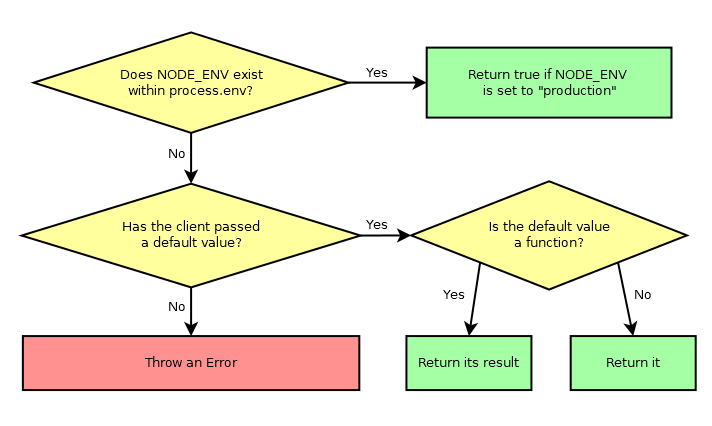

# typed-env

_Functional library for type-safe environment variables_


[](https://badge.fury.io/js/@giancosta86%2Ftyped-env)
[](/LICENSE)


**typed-env** is a minimalist, _functional_ **TypeScript** library for **Node.js**, focused on _type-checked environment variables_ - that can have a _type_ and a _default value_, with lightweight notation.

Additionally, the library provides a simplified, typesafe way to explore the nuances of the **NODE_ENV** environment variable.

Only _read access_ is supported, mainly because in-process modification of environment variables tends to be a discouraged pattern - that can always be achieved by altering `process.env`; however, the _delayed_ approach adopted by **typed-env** makes the library compatible with such a dynamic scenario.

## Installation

```bash
npm install @giancosta86/typed-env
```

or

```bash
yarn add @giancosta86/typed-env
```

## Usage

All the recommended features are exported by the index file - and can be imported as usual:

```typescript
import {...} from @giancosta86/typed-env
```

### getEnv\<T\>(variable name, mapper\[, defaultValue\])

The `getEnv()` function is the very heart of the library - although you will often prefer the utility functions described below.

`getEnv()` takes 3 parameters:

- the **name** of the environment variable - the `string` that should appear as a key in `process.env`

- the **mapper** - a `(string) => T` function, mapping the `string` _raw value_ of the environment variable (if present) into the expected `T` type

- an optional **default value** - a plain `T` or a `() => T` function returning a default value; only considered when the environment variable is missing

Its outcomes are summarized in the diagram above, and can be described as follows:

- if the environment variable _exists_ in `process.env`, `getEnv()` returns the result of the **mapper** function applied to the related `string` raw value

- if the environment variable is _missing_ from `process.env`:

  - when the **default value** argument is present:

    - if it is a _value_ of type `T`, it is returned directly by `getEnv()`

    - if it is a _function_, it is called with no arguments - and its return value becomes the result of `getEnv()` as well

    Anyway, the mapper does _not_ intervene

  - when also the **default value** is missing, a descriptive `Error` is thrown

Here is a brief example:

```typescript
const serverPort = getEnv(
  "SERVER_PORT",
  Number, //Minimalist notation for (rawValue) => Number(rawValue)
  8080 //Without a default plain value/function, getEnv() throws if the env var is missing
);
```

### getEnvNumber(variableName\[, defaultValue\])

Simplified access to `number`-based environment variables; in particular, the above example becomes:

```typescript
const serverPort = getEnvNumber("SERVER_PORT", 8080);
```

### getEnvBoolean(variableName\[, defaultValue\])

Vastly simplified access to `boolean`-based environment variables, because:

- the following raw values of the environment variable are interpreted as `true`:

  - **true**
  - **t**
  - **1**
  - _the empty string_

- the following raw values are interpreted as `false`:

  - **false**
  - **f**
  - **0**

- the comparison is **case-insensitive** and does not keep track of **leading/trailing whitespace**

- finally, incompatible string values will **throw an Error**

For example:

```typescript
const useCache = getEnvBoolean("USE_CACHE", true);
```

### getEnvString(variableName\[, defaultValue\])

Simplified access to `string`-based environment variables. For example:

```typescript
const apiUrl = getEnvString("API_URL", "http://localhost");
```

### NODE_ENV support

**typed-env** supports the `NODE_ENV` environment variable via:

- the `getNodeEnv()` function, that can accept an _optional_ `string` or `() => string` default value

- the `isInProduction()` function, taking an _optional_ `boolean` or `() => boolean` default value, and summarized as follows:

  

- the `isInJest()` function - working just like `isInProduction()`, but checking for the **test** value of the `NODE_ENV` variable

For example, to ascertain whether your app is in Production mode - defaulting to `true`:

```typescript
/*
 * This constant will be set to true if:
 *
 * * NODE_ENV is actually set to "production"
 *
 * * NODE_ENV is missing - because of the default value
 */
const inProduction = isInProduction(true);
```

Similarly, to just log the current NODE_ENV - and defaulting to an empty string:

```typescript
logger.log(getNodeEnv(""));
```

## Additional references

For further usage examples, please consult the Jest test suites, that provide even more detailed - and executable - documentation.
